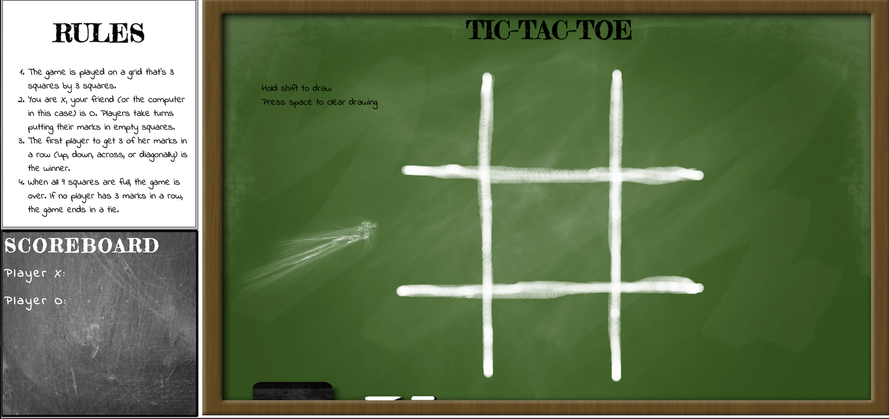

# tic-tac-toe
### GA Project 0: Tic-Tac-Toe

**Find the game at: https://harrypatrick94.github.io/tic-tac-toe/**

While playing, the game will test for a winner or failing a winner notify the players of a draw.

Players are able to draw their on board on the screen by holding the shift key and moving the mouse.

All drawings can be cleared with the space key.

The rules and the game can be found left side of the page.

**Bugs**
* At the moment the playing board is not scalable

This projects uses **HTML, CSS, JavaScript and jQuery.**
